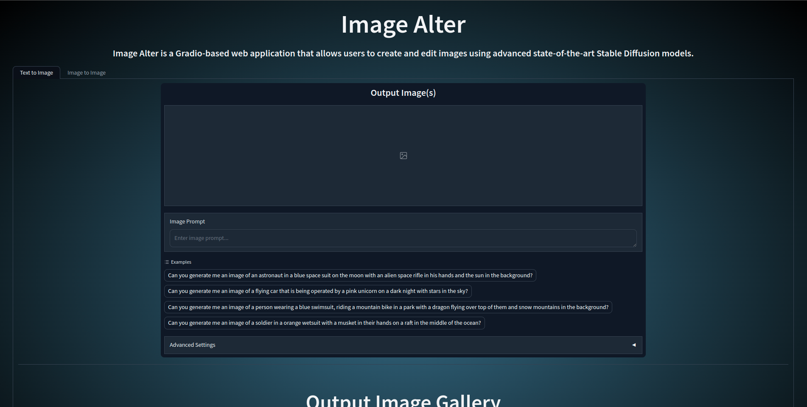
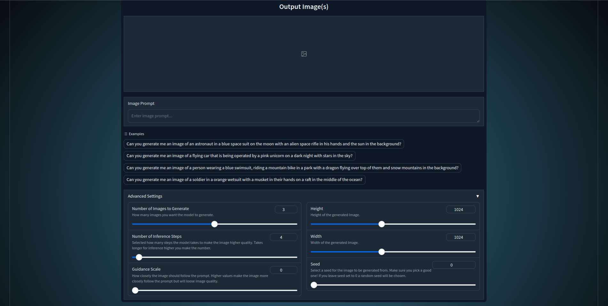
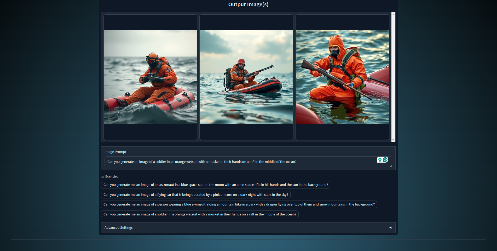
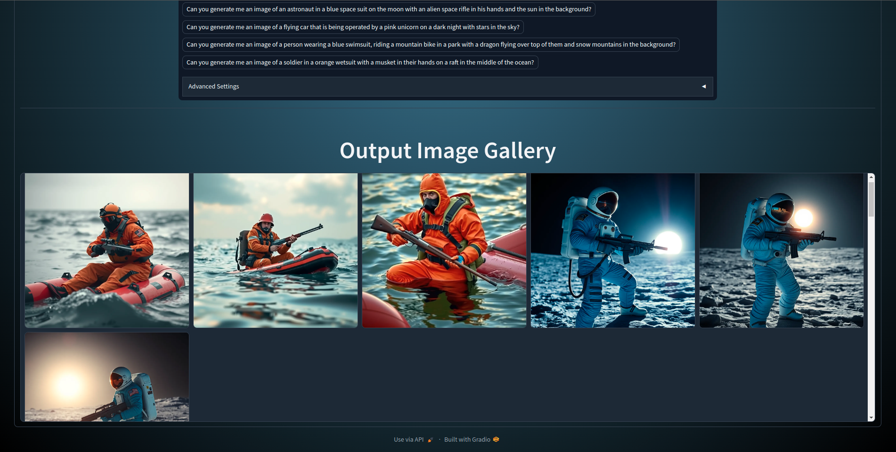
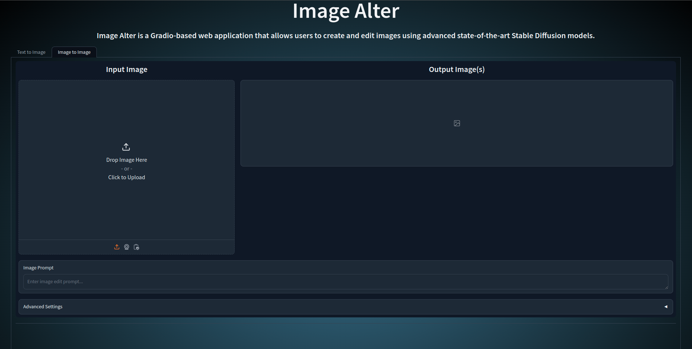

# Image Alter
Image Alter is a cutting-edge Gradio-based web application that empowers users to create and edit images using advanced 
Stable Diffusion models. Leveraging state-of-the-art AI technology, including the Flux model by Black Forest Labs 
and Stable Diffusion XL Refiner 1.0 by Stability AI, the app offers two primary functionalities: Text-to-Image 
generation and Image-to-Image transformation. With its intuitive interface, Image Alter allows users to 
transform text prompts into stunning visuals and enhance existing images with AI-driven alterations. 
Whether you're a professional designer, a digital artist, or an enthusiast exploring AI-generated imagery, 
Image Alter provides a powerful platform to bring your creative visions to life, pushing the boundaries of 
digital image manipulation.


## Features
### Text-to-Image Generation
- Create images from text prompts
- Customize generation parameters:
  - Number of images (1-5)
  - Number of inference steps (1-124)
  - Guidance scale (0.0-5.0)
  - Image height and width (256-2048 pixels)
  - Seed value (0-2147483647, 0 for random seed)
- View generated images in an interactive gallery
- Accumulate generated images in an output gallery
- Example prompts provided for inspiration

### Image-to-Image Transformation (Work In Progress)
- Edit existing images using text prompts
- Customize transformation parameters (similar to Text-to-Image)
- View transformed images in an interactive gallery
- Accumulate transformed images in an output gallery


### User Interface
- Tabbed interface for easy navigation between Text-to-Image and Image-to-Image modes
- Responsive design with radial gradient background
- Advanced settings accordion for fine-tuning generation parameters
- Responsive image galleries with download and fullscreen options


## Project Pictures
### Start State of the App

### Available Options

### Example Images

### Image Output Gallery

### Image to Image Start State



## Installation
1. Clone the repository:
```
git clone https://github.com/JakeFurtaw/ImageAlter.git
```

2. Install the required dependencies:
```
pip install gradio torch diffusers transformers pillow numpy
```

3. Run the Gradio app:
```
gradio imagealter.py
```

4. The app will automatically open in your default web browser.


## How to Use the App
### Text to Image
1. Enter a text prompt in the "Image Prompt" field
2. (Optional) Use one of the provided example prompts
3. Adjust the generation parameters in the "Advanced Settings" accordion (optional)
4. Press Enter or click Submit to generate images
5. View the generated images in the output gallery and accumulated gallery

### Image to Image
1. Upload an input image to the left input section
2. Enter a text prompt for editing in the "Image Prompt" field
3. Adjust the transformation parameters in the "Advanced Settings" accordion (optional)
4. Press Enter or click Submit to generate edited images
5. View the transformed images in the output gallery and accumulated gallery


## Models Used
- Base Model for Text-to-Image: FluxPipeline ("black-forest-labs/FLUX.1-schnell")
- Refiner Model for Image-to-Image: DiffusionPipeline ("stabilityai/stable-diffusion-xl-refiner-1.0")


## File Structure
- `imagealter.py`: Main Gradio application file
- `utils.py`: Utility functions for image generation and transformation


## Contributing
Contributions are welcome! Please feel free to submit a Pull Request.


## Acknowledgements
This project uses the FLUX.1-schnell model from Black Forest Labs and the Stable Diffusion XL Refiner model 
from Stability AI.

